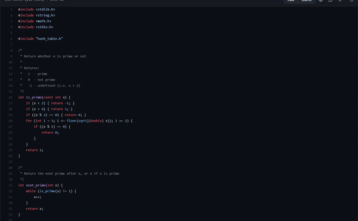

# Hash Table Implementation in C

 

## What I learnt:

1. How to create a hash table from stratch

2. How to use double hashing to handle collisions

3. How to resizing the hashtable when load is above 0.7 or below 0.1

4. How to implement a basic hash algorithm:

   - Converts the string to a large integer

   - Reduce the size of the integer to a fixed range by taking its remainder mod the hash table size

## What can be done:

- Implemnting testing for the hash table
